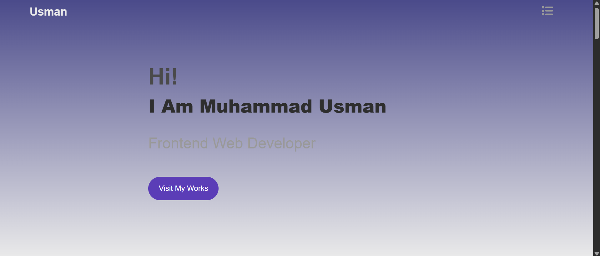
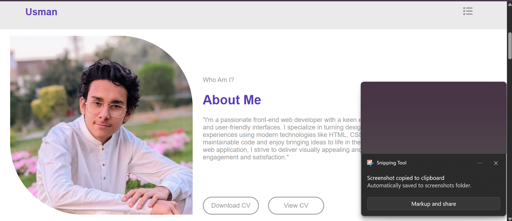
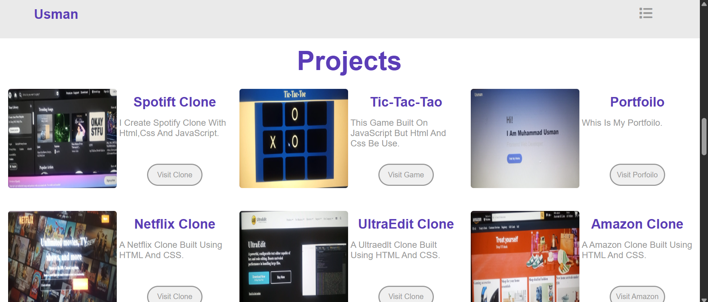
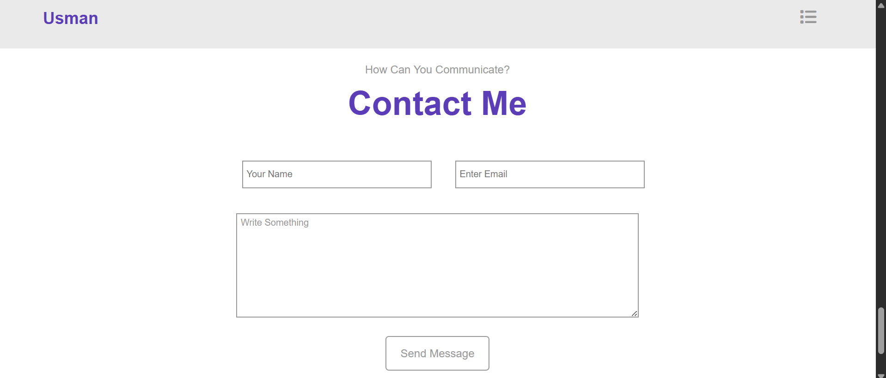

# 🌟 Frontend Portfolio Website

Ye mera personal portfolio website hai jo maine HTML, CSS, aur JavaScript se banaya hai. Is project se maine apni frontend development skills ko improve kiya hai.

## 🚀 Live Demo

[View Live Site](https://github.com/builtbyusman/Frontend-Portfolio-Website)

## 📁 Project Structure

├── index.html
├── style.css
├── secstyle.css
├── RESPONES.css
├── mind.js
├── cv/
│ └── muhammadusman.pdf
├── imgs/
│ └── (images used in site)
├── videos/
└── (videos used in site)
## 📸 Project Screenshots

### 🏠 Home Page

### 📄 About Page

### 📄 Projects Page

### 📄 Contact Page

## ✨ Features

- Responsive design
- Clean UI with CSS styling
- JavaScript animations and interactivity
- Embedded videos and images
- Downloadable resume

## 🛠️ Technologies Used

- HTML5
- CSS3 (Flexbox, Grid)
- JavaScript

## 📄 Resume

[View Resume](./CV/muhammadusman.pdf)

## 🔗 Connect with Me

- [LinkedIn](https://www.linkedin.com/in/muhammad-usman-862693367)
- [GitHub](https://github.com/builtbyusman)
- [Email](mailto:developerusman23@gmail.com)

---

Thank you for visiting my portfolio! Feedback and internship opportunities are welcome.
